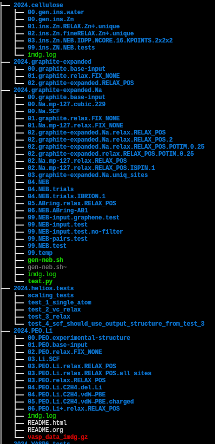
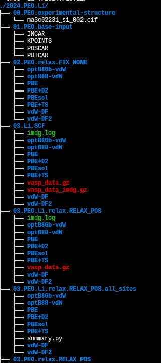

#+TITLE: VASP scripts and projects (master repo without data)
#+AUTHOR: Ihor Radchenko
#+EMAIL: yantar92@posteo.net

This repository contains common scripts used in my work projects.
The repository is a monorepo inside supercomputer, pointing to my
data folders with scripts, simulation inputs, and simulation results.

However, the =.gitignore= is configured only to include certain files
that are suitable for version control system (no data!).

* Data organization on cluster
 #folder_structure

I simply name folders as =<number>.name=. By using numbers, I can make
folders appear in the same order I want them to.

The hierarchy is the following:
1. =0000.scripts= contains common scripts not tied to any specific project
   - I add this folder to =PATH= environment variable, so that the scripts are
     accessibe anywhere
2. =<year>.<project name>= for each project
3. =9999.test= folder for quick tests
   - Used not to flood the top-level folder structure when I need to
     check something quickly
4. =<NN>.<calculation or data>= for each step of the calculation inside a project
5. I also create =9999.test= folders per-project to store failed/unused results
   - This way, =<NN>.<calculation>= folders at the top level always remain most relevant
   - If some calculation is considered as not good/useful as the project evolves, it simply
     moves into =9999.test=
6. Deeper levels depend on the details of the calculation

Illustration of the major folder structure:

Below is an example of "PEO" project folder.
- "00" is simply the experimental structure, so no deeper nesting is needed
- other steps are VASP calculations where we computed the same system,
  but using DFT functionals (different atom/electron interaction
  models). So, there is a folder for each functional: "PBE", "vdW-DF", etc.
  - these levels are usually geenrated by scripts
  - example bash script
    #+begin_src bash
      ## This example uses "imdg" command to manipulate VASP inputs

      # Create boxed Li atom
      imdg create "Li 20x20x20"
      # Enable magnetism; set non-standard ENCUT=550 to be consistent with other calculations
      imdg derive ./Li.boxed incar ISPIN:2 ENCUT:550.0
      # Create SCF calculation
      imdg derive ./ISPIN.2,ENCUT.550.0 scf

      ## The above steps simply created initial common calculation setup
      ## (structure + common simulation parameters)

      ## Now, we create multiple VASP inputs each using separate functional
      for functional in PBE PBE+D2 PBE+TS PBEsol vdW-DF vdW-DF2 optB88-vdW optB86b-vdW; do
          # In this case "imdg" create a folder named after <functional> and
          # puts VASP input inside
          imdg derive ./SCF functional $functional;
      done

      ## Cleanup intermediate VASP inputs that we are not going to run
      rm -rf Li.boxed
      rm -rf ./ISPIN.2,ENCUT.550.0
      rm -rf SCF

      ## Run VASP simulation in each created dir
      ## Uses my common script walk-dirs-level
      walk-dirs-level 1 gorun-helios 1 0:10:00
    #+end_src
  - example python script that will automatically created named structures (.cif files)
    #+begin_src python
      ## This will take structure from cellulose_ibeta.POSCAR file
      ## and generate many structures with Zn inserted
      import numpy as np
      import pymatgen.core as pmg
      from IMDgroup.pymatgen.transformations.insert_molecule\
          import InsertMoleculeTransformation

      ## Setup insertion generator
      transformer = InsertMoleculeTransformation(
          'Zn',  # we insert Zn
          step=0.1,  # we scan all possible positions with 0.1A step
          multithread=True,  # utilize multiple CPU for speed
          # criteria to reject candidate Zn sites when they are too close to
          # other atoms in the initial structure or to already known
          # accepted candidate Zn insertions
          # 0.75 means reject if <distance to any atom> < 0.75 * (sum of Zn and neighbor atomic radii)
          proximity_threshold=0.75
      )

      ## Run the generator to obtain the list of structures with Zn inserted
      ## Note that you can also pass the filename directly; not necessary to
      ## read structure manually
      structures = transformer.all_inserts('cellulose_ibeta.POSCAR')

      ## iterate over generated structures
      for idx, structure in enumerate(structures):
          ## and save to numbered .cif files
          structure.to_file(f'cellulose_ibeta_Zn_{idx:03d}.cif')
    #+end_src

* Supercomputer access
:PROPERTIES:
:ID:       ab10c05a-0b5b-4f87-8bd6-f7cdf890e988
:END:
 #server #cluster #configuration #setup #DFT #VASP #plgrid #athena #ares #helios

Server home dirs (replace my username with yours):
- [[/ssh:plgyantar92@ares.cyfronet.pl:~]]
- [[/ssh:plgyantar92@athena.cyfronet.pl:~]]
- [[/ssh:plgyantar92@helios.cyfronet.pl:~]]
- [[/ssh:radchenk@lumi.csc.fi:~]]

https://guide.plgrid.pl/en/

Ares: https://docs.cyfronet.pl/display/~plgpawlik/Ares
Athena: https://docs.cyfronet.pl/display/~plgpawlik/Athena
Helios: https://docs.cyfronet.pl/display/~plgpawlik/Helios
 - Note: We have only CPU grant here. GPU not available for now.
   See =hpc-grants= command
LUMI: https://docs.lumi-supercomputer.eu/
https://docs.lumi-supercomputer.eu/firststeps/SSH-keys/,
https://puhuri.neic.no/user_guides/myaccessid-ssh-key/,
https://www.lumi-supercomputer.eu/get-started-2021/users-in-poland/
https://guide.plgrid.pl/en/grants/lumi/computing

Directory structure:
- Project folder: =$IMDGroup=
  - This project folder is shared across Athena and Ares clusters
  - Helios group folder is not shared with Ares and Athena
  - Lumi is also separate

(replace my username with yours)
: ssh plgyantar92@ares.cyfronet.pl
: ssh plgyantar92@athena.cyfronet.pl
: ssh plgyantar92@helios.cyfronet.pl
: ssh radchenk@lumi.csc.fi

Example tramp script
#+begin_src bash :dir /ssh:ares:~ :results output
ls -al
#+end_src

** Common DFT toolchain shared across the group
:PROPERTIES:
:ID:       31b79802-ce1d-48b5-a537-abe30a9eb8c1
:END:

 *Important*: Please, add =.bashrc= snippet described below to your
 local bashrc. Our scripts may not work if it is not done.

=SCRATCH= environment will always point to the correct folder, even on LUMI
where it is not available by default.

- All the common software will be in
  : $IMDGroup/dist
  - Miniconda: =$IMDGroup/dist/anaconda3=
  - VASP: =$IMDGroup/dist/vasp.<version>-$(CLUSTER_NAME)=
    We derive VASP folder name from cluster name because VASP must be
    compiled to work with specific cluster. We cannot afford to use
    "generic" VASP installation or we may encounter bugs/degraded
    performance.
  - VASP potentials: =$IMDGroup/dist/vasp-potcar=
    Will be stored in =VASP_PSP_DIR= environment variable
  - Loading common =bashrc=; *please add the following to your local bashrc*
    #+name: IMDGroup-bashrc
    #+begin_src bash :tangle no
      # Ares, Athena, Helios
      IMDGroup="$PLG_GROUPS_STORAGE/plggkeytech"
      # LUMI
      # IMDGroup="/projappl/project_465002777"
      # Ares, Athena, Helios
      export CLUSTER_NAME="${CLUSTER_NAME:-$(uname -n)}"
      # LUMI
      # export CLUSTER_NAME="${CLUSTER_NAME:-lumi}"
      source ${IMDGroup}/dist/bashrc-${CLUSTER_NAME}
    #+end_src
  - Common =bashrc= that sets up conda environment and VASP dirs
    Will be stored in =$IMDGroup/dist/bashrc-<cluster name>=
  - The default bashrc will setup =q= command that prints job queue
    Example output:
    : (base) [ares][plgyantar92@login01 test_1_single_atom]$ q
    : JOBID             START_TIME  TIME_LEFT  NODES WORK_DIR 
    : 11339384    2024-09-11T09:59:14      14:59      1 /net/pr2/projects/plgrid/plggkeytech/yantar92/test/test_1_single_atom 
  - =gorun= command will be made available to simplify job submission

- Project directory
  #+name: IMDGroup-plgrid
  #+begin_src emacs-lisp
   "$PLG_GROUPS_STORAGE/plggkeytech"
  #+end_src
  #+name: IMDGroup-lumi
  #+begin_src emacs-lisp
   "/projappl/project_465002777"
  #+end_src
  #+name: IMDGroup-scratch-lumi
  #+begin_src emacs-lisp
   "/scratch/project_465002777"
  #+end_src
- Slurm account
  #+name: slurm-account-plgrid
  #+begin_src emacs-lisp
   "plgkeytech2-cpu"
  #+end_src
  #+name: slurm-account-lumi
  #+begin_src emacs-lisp
   "project_465002777"
  #+end_src

*** Expanded project directories and login names on all the clusters
:PROPERTIES:
:ID:       e35ad651-bd50-4aa9-9d89-25a1be10732d
:END:

1. Ares
   #+name: IMDGroup-plgrid-ares
   #+begin_src bash :dir /ssh:ares:~ :noweb yes :cache yes
     echo <<IMDGroup-plgrid>>
   #+end_src

   #+RESULTS[3478e684e045971846ebc92914d5002ffb9f8e80]: IMDGroup-plgrid-ares
   : /net/pr2/projects/plgrid/plggkeytech

   #+name: uname-ares
   #+begin_src bash :dir /ssh:plgyantar92@ares.cyfronet.pl:~ :noweb yes :cache yes
     uname -n
   #+end_src

   #+RESULTS[2b4eb731f0d9379874382cc2c5eac67ef05b9717]: uname-ares
   : login01.ares.cyfronet.pl

2. Athena
   #+name: IMDGroup-plgrid-athena
   #+begin_src bash :dir /ssh:plgyantar92@athena.cyfronet.pl:~ :noweb yes :cache yes
     echo <<IMDGroup-plgrid>>
   #+end_src

   #+RESULTS[6264983b8ccfff89a17f20598baa961f0f38280e]: IMDGroup-plgrid-athena
   : /net/pr2/projects/plgrid/plggkeytech

   #+name: uname-athena
   #+begin_src bash :dir /ssh:plgyantar92@athena.cyfronet.pl:~ :noweb yes :cache yes
     uname -n
   #+end_src

   #+RESULTS[11f69eabbb2caf92bede7d8d2753915b97b4f3d8]: uname-athena
   : login01.athena.cyfronet.pl

3. Helios
   #+name: IMDGroup-plgrid-helios
   #+begin_src bash :dir /ssh:plgyantar92@helios.cyfronet.pl:~ :noweb yes :cache yes
     echo <<IMDGroup-plgrid>>
   #+end_src

   #+RESULTS[d29891301614f44f7b6d68134353df656969182e]: IMDGroup-plgrid-helios
   : /net/storage/pr3/plgrid/plggkeytech

   #+name: uname-helios
   #+begin_src bash :dir /ssh:plgyantar92@helios.cyfronet.pl:~ :noweb yes :cache yes
     uname -n
   #+end_src

   #+RESULTS[ad11b17864d33eb600c0e38cf7a2a1062dfc0cb5]: uname-helios
   : login01.helios.cyfronet.pl

4. Lumi

   #+name: IMDGroup-plgrid-lumi
   #+begin_src bash :dir /ssh:radchenk@lumi.csc.fi:~ :noweb yes :cache yes
     echo <<IMDGroup-lumi>>
   #+end_src

   #+RESULTS[50f41f754e9934441771f4667dba572055dd0631]: IMDGroup-plgrid-lumi
   : /projappl/project_465001654

   #+name: uname-lumi
   #+begin_src bash :cache yes
     echo "lumi"
   #+end_src

   #+RESULTS[4648372ef33d1c40c0e7821acecc3b80986742b8]: uname-lumi
   : lumi

*** (admin) Installing this README
:PROPERTIES:
:ID:       bcf8fc79-fe00-4c2a-bf84-8dbdd0a1df12
:END:

#+name: server-get-readme
#+begin_src emacs-lisp :tangle no
  (pcase-let ((`(,file . ,pos) (org-id-find "ab10c05a-0b5b-4f87-8bd6-f7cdf890e988")))
    (when (and file pos)
      (org-with-file-buffer file
        (org-with-point-at pos
  	(let ((hd (org-element-lineage (org-element-at-point) '(headline) t)))
  	  (buffer-substring-no-properties
             (org-element-begin hd)
             (org-element-end hd)))))))
#+end_src

#+name: server-IMDGroup-readme
#+begin_src org :tangle no :noweb yes
  <<server-get-readme()>>
#+end_src

*** (admin) Installing this README on Ares + Athena

The project dir is shared.

#+header: :tangle (concat "/ssh:plgyantar92@ares.cyfronet.pl:" (org-babel-ref-resolve "IMDGroup-plgrid-ares()") "/dist/README.org") 
#+begin_src org :mkdirp yes :noweb yes :comments no
<<server-IMDGroup-readme>>
#+end_src
*** (admin) Installing this README on Helios

The project dir is shared.

#+header: :tangle (concat "/ssh:plgyantar92@helios.cyfronet.pl:" (org-babel-ref-resolve "IMDGroup-plgrid-helios()") "/dist/README.org") 
#+begin_src org :mkdirp yes :noweb yes :comments no
<<server-IMDGroup-readme>>
#+end_src

*** (admin) Installing this README on LUMI

#+header: :tangle (concat "/ssh:radchenk@lumi.csc.fi:" (org-babel-ref-resolve "IMDGroup-plgrid-lumi()") "/dist/README.org") 
#+begin_src org :mkdirp yes :noweb yes :comments no
<<server-IMDGroup-readme>>
#+end_src

*** (admin) Common =bashrc= script
:PROPERTIES:
:ID:       c13fb843-c94e-4f94-97da-d68d665598ae
:END:

The script sets up:
1. Anaconda environment with standard python libraries
2. VASP binaries to be in the PATH
3. =q= Alias to print the current job queue
4. gorun script, configured to use appropriate potentials and VASP

 [2025-01-17 Fri] *Important* VASP 6.4.3 has issues with numerical
   stability on various clusters (to various degrees, but still
   issues; see "set2" tests). For the time being, we are going to use VASP 6.2.1

#+name: server-IMDGroup-bashrc
#+begin_src bash :tangle no
  # IMDGroup variable must be set to group folder location

  # VASP version to be used
  VASP_VERSION="${VASP_VERSION:-6.2.1}"

  [[ -z "$IMDGroup" ]] && echo "!!! IMD Group env error :: IMD group folder not set" >&2
  export IMDGroup

  [[ -z "$CLUSTER_NAME" ]] && echo "!!! IMD Group env error: CLUSTER_NAME is not set.  Check your ~/.bashrc" >&2
  export CLUSTER_NAME="${CLUSTER_NAME:-$(uname -n)}"

  if [[ ! -z "$IMDGroup" ]]; then

      # >>> conda initialize >>>
      CONDA_LOCATION=${IMDGroup}/dist/miniconda3

      if [[ ! -d "$CONDA_LOCATION" ]]; then

  	echo "!!! IMD Group env error :: Miniconda installation does not exist at: $CONDA_LOCATION" >&2

      else

  	# !! Contents within this block are managed by 'conda init' !!
          # 2026-03-27: Disabling /bin/conda as it requires spinning python that slows down shell loading.
  	# __conda_setup="$("${CONDA_LOCATION}/bin/conda" 'shell.bash' 'hook' 2> /dev/null)"
  	# if [ $? -eq 0 ]; then
  	#     eval "$__conda_setup"
  	# else
  	#     if [ -f "${CONDA_LOCATION}/etc/profile.d/conda.sh" ]; then
  	# 	. "${CONDA_LOCATION}/etc/profile.d/conda.sh"
  	#     else
  	# 	export PATH="${CONDA_LOCATION}/bin:$PATH"
  	#     fi
  	# fi
  	if [ -f "${CONDA_LOCATION}/etc/profile.d/conda.sh" ]; then
  	    export PATH="${CONDA_LOCATION}/bin:$PATH"
  	    . "${CONDA_LOCATION}/etc/profile.d/conda.sh"
  	else
  	    export PATH="${CONDA_LOCATION}/bin:$PATH"
  	fi
  	unset __conda_setup
  	# <<< conda initialize <<<

      fi

      # VASP path
      VASP_PATH="${IMDGroup}/dist/vasp.${VASP_VERSION}-${CLUSTER_NAME}"

      if [[ ! -d "$VASP_PATH" ]]; then
          echo "!!! IMD Group env error :: VASP installation directory does not exist at: $VASP_PATH" >&2
      else 
  	export PATH="${VASP_PATH}/bin:$PATH"
  	export VASP_PP_PATH="${IMDGroup}/dist/vasp-potcar"
          export PMG_VASP_PSP_DIR="${VASP_PP_PATH}"
          export VASP_PATH
          export VASP_VERSION
      fi
  fi

  # common scripts
  export PATH="${IMDGroup}/dist/bin:$PATH"

  # Store imdg cache on $SCRATCH
  [[ ! -z "$SCRATCH" ]] && export XDG_CACHE_HOME="$SCRATCH/imdgVASPDIRcache"

  # Common aliases
  alias q="squeue -o '%.10i %.22S %.10L %.6D %Z ' -u ${USER}"
  alias scall="srun --account=${SLURM_ACCOUNT}"
  alias sbash="scall -c 8 --time=24:00:00 --pty /bin/bash -l"
#+end_src

*** (admin) Common =bashrc= script on Ares
:PROPERTIES:
:ID:       60cc6673-f296-4a0f-813a-11ad5f17461d
:END:

#+header: :tangle (concat "/ssh:plgyantar92@ares.cyfronet.pl:" (org-babel-ref-resolve "IMDGroup-plgrid-ares()") "/dist/bashrc-" (org-babel-ref-resolve "uname-ares()")) 
#+begin_src bash :noweb yes
  export IMDGroup="<<IMDGroup-plgrid()>>"
  export SLURM_ACCOUNT="<<slurm-account-plgrid()>>"
  <<server-IMDGroup-bashrc>>
#+end_src

#+header: :tangle (concat "/ssh:plgyantar92@ares.cyfronet.pl:" (org-babel-ref-resolve "IMDGroup-plgrid-ares()") "/dist/bashrc.example") 
#+begin_src bash :noweb yes
  # Ares, Athena, Helios
  IMDGroup="<<IMDGroup-plgrid()>>"
  export CLUSTER_NAME="${CLUSTER_NAME:-$(uname -n)}"
  source ${IMDGroup}/dist/bashrc-${CLUSTER_NAME}
#+end_src

*** (admin) Common =bashrc= script on Athena
:PROPERTIES:
:ID:       ba3cc35c-fc89-44ae-ac4c-8ffe9bd3e04e
:END:

#+header: :tangle (concat "/ssh:plgyantar92@athena.cyfronet.pl:" (org-babel-ref-resolve "IMDGroup-plgrid-athena()") "/dist/bashrc-" (org-babel-ref-resolve "uname-athena()")) 
#+begin_src bash :noweb yes
  export IMDGroup="<<IMDGroup-plgrid()>>"
  export SLURM_ACCOUNT="<<slurm-account-plgrid()>>"
  <<server-IMDGroup-bashrc>>
#+end_src

#+header: :tangle (concat "/ssh:plgyantar92@athena.cyfronet.pl:" (org-babel-ref-resolve "IMDGroup-plgrid-athena()") "/dist/bashrc.example") 
#+begin_src bash :noweb yes
  # Ares, Athena, Helios
  IMDGroup="<<IMDGroup-plgrid()>>"
  export CLUSTER_NAME="${CLUSTER_NAME:-$(uname -n)}"
  source ${IMDGroup}/dist/bashrc-${CLUSTER_NAME}
#+end_src

*** (admin) Common =bashrc= script on Helios
:PROPERTIES:
:ID:       8704a8fc-8c3a-4897-8332-f2f76921d925
:END:

#+header: :tangle (concat "/ssh:plgyantar92@helios.cyfronet.pl:" (org-babel-ref-resolve "IMDGroup-plgrid-helios()") "/dist/bashrc-" (org-babel-ref-resolve "uname-helios()")) 
#+begin_src bash :noweb yes
  export IMDGroup="<<IMDGroup-plgrid()>>"
  export SLURM_ACCOUNT="<<slurm-account-plgrid()>>"
  <<server-IMDGroup-bashrc>>
  export PATH="$IMDGroup/dist/airss-0.9.1/bin:$PATH"
  # This is needed to address complaints from Helios admins about excessive IO when using imdg tools and reading many VASP directories.
  module load GCCcore LMDB
#+end_src

#+header: :tangle (concat "/ssh:plgyantar92@helios.cyfronet.pl:" (org-babel-ref-resolve "IMDGroup-plgrid-helios()") "/dist/bashrc.example") 
#+begin_src bash :noweb yes
  # Ares, Athena, Helios
  IMDGroup="<<IMDGroup-plgrid()>>"
  export CLUSTER_NAME="${CLUSTER_NAME:-$(uname -n)}"
  source ${IMDGroup}/dist/bashrc-${CLUSTER_NAME}
#+end_src

*** (admin) Common =bashrc= script on LUMI
:PROPERTIES:
:ID:       82d152c1-439d-4be3-a91b-4c339e7cf801
:END:

#+header: :tangle (concat "/ssh:radchenk@lumi.csc.fi:" (org-babel-ref-resolve "IMDGroup-plgrid-lumi()") "/dist/bashrc-" (org-babel-ref-resolve "uname-lumi()")) 
#+begin_src bash :noweb yes
  export IMDGroup="<<IMDGroup-lumi()>>"
  export SCRATCH="<<IMDGroup-scratch-lumi()>>"
  export SLURM_ACCOUNT="<<slurm-account-lumi()>>"
  export EBU_USER_PREFIX=<<IMDGroup-lumi()>>/dist/EasyBuild
  <<server-IMDGroup-bashrc>>
  module load LUMI/25.03 partition/C LMDB/0.9.31-cpeCray-25.03
#+end_src

#+header: :tangle (concat "/ssh:radchenk@lumi.csc.fi:" (org-babel-ref-resolve "IMDGroup-plgrid-lumi()") "/dist/bashrc.example") 
#+begin_src bash :tangle no :noweb yes
  # LUMI
  export IMDGroup="<<IMDGroup-lumi()>>"
  export CLUSTER_NAME="${CLUSTER_NAME:-lumi}"
  source ${IMDGroup}/dist/bashrc-${CLUSTER_NAME}
#+end_src

*** (admin) Installing Miniconda
:PROPERTIES:
:ID:       d1e0d8b5-b87a-44cf-8c94-90892e20a708
:END:

Initial python + libs setup:

We use miniconda because it provides self-containing Python
installation + necessary system libraries. Not all the clusters do
provide the system libraries, and even if they do, versions may vary.
So, miniconda gives the most consistent setup we may rely upon without
having to fight potential upgrade breakage or _different_
inconsistencies caused by subtle bugs in different library versions.

This setup should ideally go to shared group folder, so that the whole
group use consistent base Python setup.

#+name: server-install-python-libs
#+begin_src bash :tangle no
  echo "IMD group dir: $IMDGroup"
  [[ -z "$IMDGroup" ]] && echo "Empty group directory" && exit 1
  mkdir -p "${IMDGroup}/dist"
  CONDA_LOCATION="${IMDGroup}/dist/miniconda3"

  cd $SCRATCH
  wget https://repo.anaconda.com/miniconda/Miniconda3-latest-Linux-x86_64.sh
  # Run in batch mode (-b), run tests (-t) to ensure that everything is fine
  bash Miniconda3-latest-Linux-x86_64.sh -b -t -p $CONDA_LOCATION
  # Load conda
  __conda_setup="$("${CONDA_LOCATION}/bin/conda" 'shell.bash' 'hook' 2> /dev/null)"
  if [ $? -eq 0 ]; then
      eval "$__conda_setup"
  else
      if [ -f "${CONDA_LOCATION}/etc/profile.d/conda.sh" ]; then
          . "${CONDA_LOCATION}/etc/profile.d/conda.sh"
      else
          export PATH="${CONDA_LOCATION}/bin:$PATH"
      fi
  fi
  unset __conda_setup
  # Download base python APIs common for the whole group
  # We do not fix version here as we are in control
  pip install git+https://git.sr.ht/~yantar92/IMDgroup-pymatgen
  pip install git+https://git.sr.ht/~yantar92/IMDgroup-gorun
  # Install ase; fix version; bump as we need, but do it explicitly
  pip install ase==3.23.0
#+end_src

Verify that installation worked

#+name: server-check-installation
#+begin_src bash :tangle no
  die() {
      echo "$1" >&2
      exit 1
  }

  source .bashrc
  [[ -z "$IMDGroup" ]] && die "Empty group directory"
  conda info | grep "active env location : $IMDGroup" && echo "Conda is in the right dir" || die "Conda installation problem"
  python -c 'import ase; print("Success ase")' || die "Cannot load ase"
  python -c 'import pymatgen; print("Success pymatgen")' || die "Cannot load pymatgen"
#+end_src

*** (admin) Installing Miniconda on Ares and Athena
:PROPERTIES:
:ID:       1fe901fc-44f9-460d-9145-52bfcc509be4
:END:

Generic scripts should work.
We share the same group folder on Ares and Athena.
Conda should be usable on both clusters.

#+header: :tangle (concat "/ssh:plgyantar92@ares.cyfronet.pl:" (org-babel-ref-resolve "IMDGroup-plgrid-ares()") "/dist/python-install.sh") 
#+begin_src bash :shebang #!/usr/bin/bash
<<server-install-python-libs>>
#+end_src

*** (admin) Installing Miniconda on Helios
:PROPERTIES:
:ID:       cbb198eb-27c6-48b5-a1e9-0fbf94b24bef
:END:

Generic scripts should work.
Unlike Ares and Athena, Helios uses a separate group folder.

#+header: :tangle (concat "/ssh:plgyantar92@helios.cyfronet.pl:" (org-babel-ref-resolve "IMDGroup-plgrid-helios()") "/dist/python-install.sh") 
#+begin_src bash :shebang #!/usr/bin/bash
<<server-install-python-libs>>
#+end_src

*** (admin) Installing Miniconda on LUMI
:PROPERTIES:
:ID:       1bd70741-68da-4d9d-9612-d46902317c41
:END:

According to https://docs.lumi-supercomputer.eu/software/installing/python/,
LUMI strongly discourages Conda installations due to poor shared FS
performance on many small files.

Instead, it provides a special container wrapper:
https://docs.lumi-supercomputer.eu/software/installing/container-wrapper/

#+header: :tangle (concat "/ssh:radchenk@lumi.csc.fi:" (org-babel-ref-resolve "IMDGroup-plgrid-lumi()") "/dist/python-install.sh") 
#+begin_src bash :shebang #!/usr/bin/bash
  echo "IMD group dir: $IMDGroup"
  [[ -z "$IMDGroup" ]] && echo "Empty group directory" && exit 1
  mkdir -p "${IMDGroup}/dist"
  CONDA_LOCATION="${IMDGroup}/dist/miniconda3"

  cd "${IMDGroup}/dist"
  git clone https://git.sr.ht/~yantar92/IMDgroup-pymatgen
  git clone https://git.sr.ht/~yantar92/IMDgroup-gorun

  cd $SCRATCH

  # On LUMI, they provide alternative way to install Conda

  # wget https://repo.anaconda.com/miniconda/Miniconda3-latest-Linux-x86_64.sh
  # # Run in batch mode (-b), run tests (-t) to ensure that everything is fine
  # bash Miniconda3-latest-Linux-x86_64.sh -b -t -p $CONDA_LOCATION

  mkdir -p "${CONDA_LOCATION}"
  cat <<EOF > env.yml
  channels:
    - conda-forge
  dependencies:
    - python==3.12.4
    - pymatgen==2025.1.9
    - ase==3.23.0
    - pip
    - pip:
      - "--editable=${IMDGroup}/dist/IMDgroup-pymatgen"
      - "--editable=${IMDGroup}/dist/IMDgroup-gorun"
  EOF
  module load LUMI lumi-container-wrapper
  conda-containerize new --prefix ${CONDA_LOCATION} env.yml 

  # Load conda
  __conda_setup="$("${CONDA_LOCATION}/bin/conda" 'shell.bash' 'hook' 2> /dev/null)"
  if [ $? -eq 0 ]; then
      eval "$__conda_setup"
  else
      if [ -f "${CONDA_LOCATION}/etc/profile.d/conda.sh" ]; then
          . "${CONDA_LOCATION}/etc/profile.d/conda.sh"
      else
          export PATH="${CONDA_LOCATION}/bin:$PATH"
      fi
  fi
  unset __conda_setup
#+end_src

*** (admin) Installing VASP
:PROPERTIES:
:ID:       ba58ccdf-5150-4500-afe3-223ff65ff226
:END:

There is no single automatic recipe for VASP compilation on various
servers.  The general workflow is described in
https://www.vasp.at/wiki/index.php/Installing_VASP.6.X.X

However, depending on the cluster hardware (GPU-based, AMD-CPU-based,
Intel-CPU-based) and libraries available in the cluster, we may need
to use different VASP configurations.

It is a good idea to run =make test= at the end of the installation.
If it does not work, something is off.

 *Important note*: It is a violation of cluster policies to run
 compilation on login nodes. We need to submit compilation jobs to
 computing nodes instead. See https://kdm.cyfronet.pl/portal/Prometheus:Basics#Interactive_mode
 We may either use interactive submission or submit make calls via batch script.

 *Moreover, some software modules may not be available (or may be
 different!) on login node vs. computation node* We should always use
 computational node for compilation.

 Sample script (modules may need to be adjusted according to the cluster)
 #+begin_src bash :tangle no
   #!/bin/env bash
   #SBATCH --job-name=compile_run
   #SBATCH -N 1
   #SBATCH -t 0:15:00
   #SBATCH --ntasks-per-node=12
   #SBATCH --partition=plgrid-testing
   module load intel/2023b imkl/2023.2.0
   make veryclean
   make DEPS=1 -j12
 #+end_src

*** (admin) Installing VASP on Ares
:PROPERTIES:
:ID:       6bef177a-0bd2-49f7-8499-e48edbd3efd8
:END:

Server info: https://docs.cyfronet.pl/display/~plgpawlik/Ares#Ares-Storage
- Ares is CPU-based (for our purposes)
- CPU is Intel
- Provides module system with libraries necessary for VASP installation
  https://guide.plgrid.pl/en/applications/ares/ares_apps/

We will use Intel-only (oneapi) + OMP type of VASP configuration (=makefile.include.oneapi_omp=)

We do not install HDF5 support, even though VASP recommends it. I did
not manage to make it work.

[2024-09-11 Wed] I first tried more complex configuration, but VASP
crashed on actual run.

Necessary modules:
#+name: ares-vasp-modules
#+begin_src bash :tangle no
  module load intel/2023b imkl/2023.2.0
#+end_src

https://www.vasp.at/wiki/index.php/Makefile.include.oneapi_omp
=makefile.include=:
#+begin_src conf
  # Default precompiler options
  CPP_OPTIONS = -DHOST=\"LinuxIFC\" \
                -DMPI -DMPI_BLOCK=8000 -Duse_collective \
                -DscaLAPACK \
                -DCACHE_SIZE=4000 \
                -Davoidalloc \
                -Dvasp6 \
                -Duse_bse_te \
                -Dtbdyn \
                -Dfock_dblbuf \
                -D_OPENMP

  CPP         = fpp -f_com=no -free -w0  $*$(FUFFIX) $*$(SUFFIX) $(CPP_OPTIONS)

  FC          = mpiifort -fc=ifx -qopenmp
  FCL         = mpiifort -fc=ifx

  FREE        = -free -names lowercase

  FFLAGS      = -assume byterecl -w

  OFLAG       = -O2 
  OFLAG_IN    = $(OFLAG)
  DEBUG       = -O0 

  OBJECTS     = fftmpiw.o fftmpi_map.o fftw3d.o fft3dlib.o
  OBJECTS_O1 += fftw3d.o fftmpi.o fftmpiw.o
  OBJECTS_O2 += fft3dlib.o

  # For what used to be vasp.5.lib
  CPP_LIB     = $(CPP)
  FC_LIB      = $(FC)
  CC_LIB      = icx 
  CFLAGS_LIB  = -O
  FFLAGS_LIB  = -O1 
  FREE_LIB    = $(FREE)

  OBJECTS_LIB = linpack_double.o

  # For the parser library
  CXX_PARS    = icpx
  LLIBS       = -lstdc++

  ##
  ## Customize as of this point! Of course you may change the preceding
  ## part of this file as well if you like, but it should rarely be
  ## necessary ...
  ##

  # When compiling on the target machine itself, change this to the
  # relevant target when cross-compiling for another architecture
  VASP_TARGET_CPU ?= -xHOST
  FFLAGS     += $(VASP_TARGET_CPU)

  # Intel MKL (FFTW, BLAS, LAPACK, and scaLAPACK)
  # (Note: for Intel Parallel Studio's MKL use -mkl instead of -qmkl)
  FCL        += -qmkl
  MKLROOT    ?= /path/to/your/mkl/installation
  LLIBS      += -L$(MKLROOT)/lib/intel64 -lmkl_scalapack_lp64 -lmkl_blacs_intelmpi_lp64
  INCS        =-I$(MKLROOT)/include/fftw

  # HDF5-support (optional but strongly recommended)
  #CPP_OPTIONS+= -DVASP_HDF5
  #HDF5_ROOT  ?= /path/to/your/hdf5/installation
  #LLIBS      += -L$(HDF5_ROOT)/lib -lhdf5_fortran
  #INCS       += -I$(HDF5_ROOT)/include

  # For the VASP-2-Wannier90 interface (optional)
  #CPP_OPTIONS    += -DVASP2WANNIER90
  #WANNIER90_ROOT ?= /path/to/your/wannier90/installation
  #LLIBS          += -L$(WANNIER90_ROOT)/lib -lwannier

  # For the fftlib library (hardly any benefit in combination with MKL's FFTs)
  #FCL         = mpiifort fftlib.o -qmkl
  #CXX_FFTLIB  = icpc -qopenmp -std=c++11 -DFFTLIB_USE_MKL -DFFTLIB_THREADSAFE
  #INCS_FFTLIB = -I./include -I$(MKLROOT)/include/fftw
  #LIBS       += fftlib
#+end_src

*** (admin) Installing VASP on Athena
:PROPERTIES:
:ID:       8ebc33d5-aa67-4589-8f5e-8bb41959d4e3
:END:

Server info: https://docs.cyfronet.pl/display/~plgpawlik/Athena
- Athena is GPU-based
- GPU is AMD
- Provides module system with libraries necessary for VASP installation
  https://guide.plgrid.pl/en/applications/athena/athena_apps/

We will use makefile.include.nvhpc_acc

We do not install HDF5 support, even though VASP recommends it. I did
not manage to make it work.

 *Important*: Athena does not have libpthread and other glibc libraries.
 I had to specify glibc location myself to make things compile (see makefile).
 Not yet sure if this succeeded.

Necessary modules:
#+name: athena-vasp-modules
#+begin_src bash :tangle no
   module load nvompic/2022a FFTW/3.3.10
#+end_src

=makefile.include=:
#+begin_src conf
  # Default precompiler options
  CPP_OPTIONS = -DHOST=\"LinuxNV\" \
                -DMPI -DMPI_INPLACE -DMPI_BLOCK=8000 -Duse_collective \
                -DscaLAPACK \
                -DCACHE_SIZE=4000 \
                -Davoidalloc \
                -Dvasp6 \
                -Duse_bse_te \
                -Dtbdyn \
                -Dqd_emulate \
                -Dfock_dblbuf \
                -D_OPENMP \
                -D_OPENACC \
                -DUSENCCL 

  CPP         = nvfortran -Mpreprocess -Mfree -Mextend -E $(CPP_OPTIONS) $*$(FUFFIX)  > $*$(SUFFIX)

  # N.B.: you might need to change the cuda-version here
  #       to one that comes with your NVIDIA-HPC SDK
  CC          = mpicc  -acc -gpu=cc60,cc70,cc80,cuda11.8 -mp
  FC          = mpif90 -acc -gpu=cc60,cc70,cc80,cuda11.8 -mp
  FCL         = mpif90 -acc -gpu=cc60,cc70,cc80,cuda11.8 -mp -c++libs

  FREE        = -Mfree

  FFLAGS      = -Mbackslash -Mlarge_arrays

  OFLAG       = -fast

  DEBUG       = -Mfree -O0 -traceback

  OBJECTS     = fftmpiw.o fftmpi_map.o fftw3d.o fft3dlib.o

  LLIBS       = -cudalib=cublas,cusolver,cufft,nccl -cuda

  # Note from Ihor
  # Needed for stdc++ library
  LLIBS 	+= -L$(EBROOTGCCCORE)/lib64
  # Needed for libpthread library that is currently missing in Athena
  # I had to compile glibc manually
  LLIBS 	+= -L/net/tscratch/people/plgyantar92/vasp/glibc/nptl/
  LLIBS 	+= -L/net/tscratch/people/plgyantar92/vasp/glibc/dlfcn/ 
  LLIBS 	+= -L/net/tscratch/people/plgyantar92/vasp/glibc/rt/

  # Redefine the standard list of O1 and O2 objects
  SOURCE_O1  := pade_fit.o minimax_dependence.o
  SOURCE_O2  := pead.o

  # For what used to be vasp.5.lib
  CPP_LIB     = $(CPP)
  FC_LIB      = $(FC)
  CC_LIB      = $(CC)
  CFLAGS_LIB  = -O -w
  FFLAGS_LIB  = -O1 -Mfixed
  FREE_LIB    = $(FREE)

  OBJECTS_LIB = linpack_double.o

  # Note from Ihor: The extra -I should not be necessary, but they
  # apparently are. Maybe GCCcore module is not properly configured (it
  # does not add INCLUDE paths)

  # For the parser library
  CXX_PARS    = nvc++ --no_warnings -I$(EBROOTGCCCORE)/include/c++/11.3.0 -I$(EBROOTGCCCORE)/include/c++/11.3.0/x86_64-pc-linux-gnu/

  ##
  ## Customize as of this point! Of course you may change the preceding
  ## part of this file as well if you like, but it should rarely be
  ## necessary ...
  ##
  # When compiling on the target machine itself , change this to the
  # relevant target when cross-compiling for another architecture
  VASP_TARGET_CPU ?= -tp host
  FFLAGS     += $(VASP_TARGET_CPU)

  # Specify your NV HPC-SDK installation (mandatory)
  #... first try to set it automatically
  NVROOT      =$(shell which nvfortran | sed 's|/compilers/bin/nvfortran||')

  # If the above fails, then NVROOT needs to be set manually
  #NVHPC      ?= /opt/nvidia/hpc_sdk
  #NVVERSION   = 21.11
  #NVROOT      = $(NVHPC)/Linux_x86_64/$(NVVERSION)

  ## Improves performance when using NV HPC-SDK >=21.11 and CUDA >11.2
  OFLAG_IN   = -fast -Mwarperf
  SOURCE_IN  := nonlr.o

  # Software emulation of quadruple precsion (mandatory)
  QD         ?= $(NVROOT)/compilers/extras/qd
  LLIBS      += -L$(QD)/lib -lqdmod -lqd
  INCS       += -I$(QD)/include/qd

  # BLAS (mandatory)
  BLAS        = -lblas

  # LAPACK (mandatory)
  LAPACK      = -llapack

  # Note from Ihor
  # This one was tricky
  # Library loads are ugly, but it only works like this, in this exact
  # order (we should not use $NVROT version of libmpi

  # scaLAPACK (mandatory)
  SCALAPACK  = -L$(EBROOTOPENMPI)/lib -L$(NVROOT)/comm_libs/hpcx/hpcx-2.12/ompi/lib -Mscalapack

  LLIBS      += $(SCALAPACK) $(LAPACK) $(BLAS)

  # FFTW (mandatory)
  FFTW_ROOT  ?= $(EBROOTFFTW)
  LLIBS      += -L$(FFTW_ROOT)/lib -lfftw3 -lfftw3_omp
  INCS       += -I$(FFTW_ROOT)/include

  # Use cusolvermp (optional)
  # supported as of NVHPC-SDK 24.1 (and needs CUDA-11.8)
  # CPP_OPTIONS+= -DCUSOLVERMP -DCUBLASMP
  # LLIBS      += -cudalib=cusolvermp,cublasmp -lnvhpcwrapcal

  # HDF5-support (optional but strongly recommended)
  #CPP_OPTIONS+= -DVASP_HDF5
  #HDF5_ROOT  ?= /path/to/your/hdf5/installation
  #LLIBS      += -L$(HDF5_ROOT)/lib -lhdf5_fortran
  #INCS       += -I$(HDF5_ROOT)/include

  # For the VASP-2-Wannier90 interface (optional)
  #CPP_OPTIONS    += -DVASP2WANNIER90
  #WANNIER90_ROOT ?= /path/to/your/wannier90/installation
  #LLIBS          += -L$(WANNIER90_ROOT)/lib -lwannier

  # For the fftlib library (hardly any benefit for the OpenACC GPU port)
  #CPP_OPTIONS+= -Dsysv
  #FCL        += fftlib.o
  #CXX_FFTLIB  = nvc++ -mp --no_warnings -std=c++11 -DFFTLIB_THREADSAFE
  #INCS_FFTLIB = -I./include -I$(FFTW_ROOT)/include
  #LIBS       += fftlib
  #LLIBS      += -ldl
#+end_src

*** (admin) Installing VASP on Helios
:PROPERTIES:
:ID:       55d40f96-291d-420d-a3a7-fee9f4294380
:END:

Server info: https://docs.cyfronet.pl/display/~plgpawlik/Helios
- Helios is CPU+GPU-based, but our grant is only for CPU
- CPU is AMD
- Provides module system with libraries necessary for VASP installation
  https://guide.plgrid.pl/en/applications/athena/athena_apps/

We will use GNU toolchain + OMP type of VASP configuration (=makefile.include.gnu_omp=)

We ignore the fact that it is AMD CPU - AMD CPU-specific config.

We do not install HDF5 support, even though VASP recommends it.

 *It is important to compile from srun shell; otherwise modules will not load*
 : srun --pty /bin/bash -l

#+name: helios-vasp-modules
#+begin_src bash :tangle no :noweb yes
  module load GCC/13.2.0 OpenMPI/5.0.3 OpenBLAS/0.3.24 ScaLAPACK/2.2.0-fb FFTW/3.3.10 
#+end_src

=makefile.include=:
#+begin_src conf
  # Default precompiler options
  CPP_OPTIONS = -DHOST=\"LinuxGNU\" \
                -DMPI -DMPI_BLOCK=8000 -Duse_collective \
                -DscaLAPACK \
                -DCACHE_SIZE=4000 \
                -Davoidalloc \
                -Dvasp6 \
                -Duse_bse_te \
                -Dtbdyn \
                -Dfock_dblbuf \
                -D_OPENMP

  CPP         = gcc -E -C -w $*$(FUFFIX) >$*$(SUFFIX) $(CPP_OPTIONS)

  FC          = mpif90 -fopenmp
  FCL         = mpif90 -fopenmp

  FREE        = -ffree-form -ffree-line-length-none

  FFLAGS      = -w -ffpe-summary=none

  OFLAG       = -O2
  OFLAG_IN    = $(OFLAG)
  DEBUG       = -O0

  OBJECTS     = fftmpiw.o fftmpi_map.o fftw3d.o fft3dlib.o
  OBJECTS_O1 += fftw3d.o fftmpi.o fftmpiw.o
  OBJECTS_O2 += fft3dlib.o

  # For what used to be vasp.5.lib
  CPP_LIB     = $(CPP)
  FC_LIB      = $(FC)
  CC_LIB      = gcc
  CFLAGS_LIB  = -O
  FFLAGS_LIB  = -O1
  FREE_LIB    = $(FREE)

  OBJECTS_LIB = linpack_double.o

  # For the parser library
  CXX_PARS    = g++
  LLIBS       = -lstdc++

  ##
  ## Customize as of this point! Of course you may change the preceding
  ## part of this file as well if you like, but it should rarely be
  ## necessary ...
  ##

  # When compiling on the target machine itself, change this to the
  # relevant target when cross-compiling for another architecture
  VASP_TARGET_CPU ?= -march=native
  FFLAGS     += $(VASP_TARGET_CPU)

  # For gcc-10 and higher (comment out for older versions)
  FFLAGS     += -fallow-argument-mismatch

  # BLAS and LAPACK (mandatory)
  OPENBLAS_ROOT ?= $(EBROOTOPENBLAS)
  BLASPACK    = -L$(OPENBLAS_ROOT)/lib -lopenblas

  # scaLAPACK (mandatory)
  SCALAPACK_ROOT ?= $(EBROOTSKALAPACK)
  SCALAPACK   = -L$(SCALAPACK_ROOT)/lib -lscalapack

  LLIBS      += $(SCALAPACK) $(BLASPACK)

  # FFTW (mandatory)
  FFTW_ROOT  ?= $(EBROOTFFTW)
  LLIBS      += -L$(FFTW_ROOT)/lib -lfftw3 -lfftw3_omp
  INCS       += -I$(FFTW_ROOT)/include

  # HDF5-support (optional but strongly recommended)
  #CPP_OPTIONS+= -DVASP_HDF5
  #HDF5_ROOT  ?= /path/to/your/hdf5/installation
  #LLIBS      += -L$(HDF5_ROOT)/lib -lhdf5_fortran
  #INCS       += -I$(HDF5_ROOT)/include

  # For the VASP-2-Wannier90 interface (optional)
  #CPP_OPTIONS    += -DVASP2WANNIER90
  #WANNIER90_ROOT ?= /path/to/your/wannier90/installation
  #LLIBS          += -L$(WANNIER90_ROOT)/lib -lwannier

  # For the fftlib library (recommended)
  CPP_OPTIONS+= -Dsysv
  FCL        += fftlib.o
  CXX_FFTLIB  = g++ -fopenmp -std=c++11 -DFFTLIB_THREADSAFE
  INCS_FFTLIB = -I./include -I$(FFTW_ROOT)/include
  LIBS       += fftlib
  LLIBS      += -ldl
#+end_src

:failed-attempts:
We will install the toolchain with conda (conda-forge) because the
toolchains on the cluster do not work.
[2024-09-13 Fri] It turned out that GNU toolchain actually does work,
but it parses =KPOINTS= file slightly differently - some of the tests
defined k-point grid using fractional numbers, which is apparently not
allowed in the GNU toolchain builds.
[2024-09-13 Fri] conda-forge has quirks - environment isolation is not
perfect and system glibc is apparently being partially hooked during
compilation time and maybe during runtime. I could continue
investigating further, but it should (maybe) be more reliable to use
native module system - it has all the same tools. If native GCC
toolchain does not yield crashes like conda's GCC, I'll go with
native.
 *Must use Conda forge*
#+begin_src bash :tangle no
  conda install gfortran_linux-64 gxx_linux-64 gcc_linux-64 openmpi openblas scalapack fftw
#+end_src
#+begin_src conf
  # Default precompiler options
  CPP_OPTIONS = -DHOST=\"LinuxGNU\" \
                -DMPI -DMPI_BLOCK=8000 -Duse_collective \
                -DscaLAPACK \
                -DCACHE_SIZE=4000 \
                -Davoidalloc \
                -Dvasp6 \
                -Duse_bse_te \
                -Dtbdyn \
                -Dfock_dblbuf \
                -D_OPENMP
  GCC         = $(CONDA_PREFIX)/bin/gcc -I$(CONDA_PREFIX)/include -L$(CONDA_PREFIX)/lib
  GPP         = $(CONDA_PREFIX)/bin/g++ -I$(CONDA_PREFIX)/include -L$(CONDA_PREFIX)/lib
  MPIF90      = $(CONDA_PREFIX)/bin/mpif90 -I$(CONDA_PREFIX)/include -L$(CONDA_PREFIX)/lib
  CPP         = $(GCC) -E -C -w $*$(FUFFIX) >$*$(SUFFIX) $(CPP_OPTIONS)

  FC          = $(MPIF90) -fopenmp
  FCL         = $(MPIF90) -fopenmp

  FREE        = -ffree-form -ffree-line-length-none

  FFLAGS      = -w -ffpe-summary=none

  OFLAG       = -O2
  OFLAG_IN    = $(OFLAG)
  DEBUG       = -O0

  OBJECTS     = fftmpiw.o fftmpi_map.o fftw3d.o fft3dlib.o
  OBJECTS_O1 += fftw3d.o fftmpi.o fftmpiw.o
  OBJECTS_O2 += fft3dlib.o

  # For what used to be vasp.5.lib
  CPP_LIB     = $(CPP)
  FC_LIB      = $(FC)
  CC_LIB      = $(GCC)
  CFLAGS_LIB  = -O
  FFLAGS_LIB  = -O1
  FREE_LIB    = $(FREE)

  OBJECTS_LIB = linpack_double.o

  # For the parser library
  CXX_PARS    = $(GPP)
  LLIBS       = -lstdc++

  ##
  ## Customize as of this point! Of course you may change the preceding
  ## part of this file as well if you like, but it should rarely be
  ## necessary ...
  ##

  # When compiling on the target machine itself, change this to the
  # relevant target when cross-compiling for another architecture
  VASP_TARGET_CPU ?= -march=native
  FFLAGS     += $(VASP_TARGET_CPU)

  # For gcc-10 and higher (comment out for older versions)
  FFLAGS     += -fallow-argument-mismatch

  # BLAS and LAPACK (mandatory)
  OPENBLAS_ROOT ?= $(CONDA_PREFIX)
  BLASPACK    = -L$(OPENBLAS_ROOT)/lib -lopenblas

  # scaLAPACK (mandatory)
  SCALAPACK_ROOT ?= $(CONDA_PREFIX)
  SCALAPACK   = -L$(SCALAPACK_ROOT)/lib -lscalapack

  LLIBS      += $(SCALAPACK) $(BLASPACK)

  # FFTW (mandatory)
  FFTW_ROOT  ?= $(CONDA_PREFIX)
  LLIBS      += -L$(FFTW_ROOT)/lib -lfftw3 -lfftw3_omp
  INCS       += -I$(FFTW_ROOT)/include

  # HDF5-support (optional but strongly recommended)
  #CPP_OPTIONS+= -DVASP_HDF5
  #HDF5_ROOT  ?= /path/to/your/hdf5/installation
  #LLIBS      += -L$(HDF5_ROOT)/lib -lhdf5_fortran
  #INCS       += -I$(HDF5_ROOT)/include

  # For the VASP-2-Wannier90 interface (optional)
  #CPP_OPTIONS    += -DVASP2WANNIER90
  #WANNIER90_ROOT ?= /path/to/your/wannier90/installation
  #LLIBS          += -L$(WANNIER90_ROOT)/lib -lwannier

  # For the fftlib library (recommended)
  CPP_OPTIONS+= -Dsysv
  FCL        += fftlib.o
  CXX_FFTLIB  = $(GPP) -fopenmp -std=c++11 -DFFTLIB_THREADSAFE
  INCS_FFTLIB = -I./include -I$(FFTW_ROOT)/include
  LIBS       += fftlib
  LLIBS      += -ldl
#+end_src
:end:

*** (admin) Installing VASP on Lumi
:PROPERTIES:
:ID:       f1e95e4d-2cb5-403d-85ec-2274e0a7045b
:END:

Server info: https://docs.lumi-supercomputer.eu/firststeps/nextsteps/
- LUMI is CPU-based + GPU-based (we only have CPU)
- CPU is AMD
- Provides module system with libraries necessary for VASP installation
  https://docs.lumi-supercomputer.eu/software/

We will use GNU toolchain + OMP type of VASP configuration (=makefile.include.gnu_omp=)

[2025-01-17 Fri] Stability issues with VASP 6.4.3. Switching to VASP 6.2.1 where tests are consistent.

Necessary modules:
#+name: lumi-vasp-modules
#+begin_src bash :tangle no
  export EBU_USER_PREFIX=<<IMDGroup-lumi()>>/dist/EasyBuild
  # module load LUMI/24.03 partition/C PrgEnv-gnu cray-fftw/3.3.10.7 OpenBLAS/0.3.24-cpeGNU-24.03  ScaLAPACK/4.2-cpeGNU-24.03-amd
  module load LUMI/25.03 partition/C PrgEnv-gnu cray-fftw/3.3.10.7 OpenBLAS/0.3.30-cpeGNU-25.03  ScaLAPACK/5.1-cpeGNU-25.03-amd
#+end_src

In addition, I need to install ScaLAPACK and openblas via EasyBuild
See https://docs.lumi-supercomputer.eu/software/installing/easybuild/

#+begin_src bash :tangle no
  # module load LUMI/24.03 partition/C PrgEnv-gnu cray-fftw/3.3.10.7 EasyBuild-user
  module load LUMI/25.03 partition/C PrgEnv-gnu cray-fftw/3.3.10.7 EasyBuild-user
  eb ScaLAPACK-5.1-cpeGNU-25.03-amd.eb -r
  eb OpenBLAS-0.3.30-cpeGNU-25.03.eb -r
  # eb ScaLAPACK-4.2-cpeGNU-24.03-amd.eb -r
  # eb OpenBLAS-0.3.24-cpeGNU-24.03.eb -r
#+end_src

https://www.vasp.at/wiki/index.php/Makefile.include.gnu_omp
=makefile.include=:
#+begin_src conf
  # Default precompiler options
  CPP_OPTIONS = -DHOST=\"LinuxGNU\" \
                -DMPI -DMPI_BLOCK=8000 -Duse_collective \
                -DscaLAPACK \
                -DCACHE_SIZE=4000 \
                -Davoidalloc \
                -Dvasp6 \
                -Duse_bse_te \
                -Dtbdyn \
                -Dfock_dblbuf \
                -D_OPENMP

  CPP         = cc -E -C -w $*$(FUFFIX) >$*$(SUFFIX) $(CPP_OPTIONS)

  FC          = ftn -fopenmp
  FCL         = ftn -fopenmp

  FREE        = -ffree-form -ffree-line-length-none

  FFLAGS      = -w -ffpe-summary=none

  OFLAG       = -O2
  OFLAG_IN    = $(OFLAG)
  DEBUG       = -O0

  OBJECTS     = fftmpiw.o fftmpi_map.o fftw3d.o fft3dlib.o
  OBJECTS_O1 += fftw3d.o fftmpi.o fftmpiw.o
  OBJECTS_O2 += fft3dlib.o

  # For what used to be vasp.5.lib
  CPP_LIB     = $(CPP)
  FC_LIB      = $(FC)
  CC_LIB      = cc
  CFLAGS_LIB  = -O
  FFLAGS_LIB  = -O1
  FREE_LIB    = $(FREE)

  OBJECTS_LIB = linpack_double.o

  # For the parser library
  CXX_PARS    = CC
  LLIBS       = -lstdc++

  ##
  ## Customize as of this point! Of course you may change the preceding
  ## part of this file as well if you like, but it should rarely be
  ## necessary ...
  ##

  # When compiling on the target machine itself, change this to the
  # relevant target when cross-compiling for another architecture

  # Disable as per https://docs.lumi-supercomputer.eu/development/compiling/prgenv/#choosing-the-target-architecture
  # VASP_TARGET_CPU ?= -march=native
  FFLAGS     += $(VASP_TARGET_CPU)

  # For gcc-10 and higher (comment out for older versions)
  FFLAGS     += -fallow-argument-mismatch

  # BLAS and LAPACK (mandatory)
  OPENBLAS_ROOT ?= /usr
  BLASPACK    = -L$(OPENBLAS_ROOT)/lib -lopenblas

  # scaLAPACK (mandatory)
  SCALAPACK_ROOT ?= /usr
  SCALAPACK   = -L$(SCALAPACK_ROOT)/lib -lscalapack

  LLIBS      += $(SCALAPACK) $(BLASPACK)

  # FFTW (mandatory)
  FFTW_ROOT  ?= /usr
  LLIBS      += -L$(FFTW_ROOT)/lib -lfftw3 -lfftw3_omp
  INCS       += -I$(FFTW_ROOT)/include

  # HDF5-support (optional but strongly recommended)
  #CPP_OPTIONS+= -DVASP_HDF5
  #HDF5_ROOT  ?= /path/to/your/hdf5/installation
  #LLIBS      += -L$(HDF5_ROOT)/lib -lhdf5_fortran
  #INCS       += -I$(HDF5_ROOT)/include

  # For the VASP-2-Wannier90 interface (optional)
  #CPP_OPTIONS    += -DVASP2WANNIER90
  #WANNIER90_ROOT ?= /path/to/your/wannier90/installation
  #LLIBS          += -L$(WANNIER90_ROOT)/lib -lwannier

  # For the fftlib library (recommended)
  #CPP_OPTIONS+= -Dsysv
  #FCL        += fftlib.o
  #CXX_FFTLIB  = CC -fopenmp -std=c++11 -DFFTLIB_THREADSAFE
  #INCS_FFTLIB = -I./include -I$(FFTW_ROOT)/include
  #LIBS       += fftlib
  #LLIBS      += -ldl
#+end_src

:failed-attempts:
[2025-01-15 Wed] We got numerical stability issues with our VASP tests.
Trying the documented installation as in
https://lumi-supercomputer.github.io/LUMI-EasyBuild-docs/v/VASP/#installing-vasp
#+begin_src bash :tangle no
  export EBU_USER_PREFIX=<<IMDGroup-lumi()>>/dist/EasyBuild
  module load LUMI/24.03 partition/C EasyBuild-user
  eb --sourcepath=$IMDGroup/dist/vasp/ VASP-6.4.3-cpeGNU-24.03-build02.eb -r
#+end_src

Necessary modules:
#+begin_src bash :tangle no
  export EBU_USER_PREFIX=<<IMDGroup-lumi()>>/dist/EasyBuild
  module load LUMI/24.03 partition/C VASP/6.4.3-cpeGNU-24.03-build02
#+end_src
:end:

*** [#A] Verifying VASP installation #vasp_tests :ATTACH:
:PROPERTIES:
:ID:       3fc322c2-8cb3-49cf-b029-b947668236f2
:END:

In addition to =make test= described earlier, [[id:82f34626-f70a-4843-b8ce-dd272d02291e][Oleksandr (Sasha) Malyi]]
suggests running a couple of additional tests, making sure that VASP
is stable when working with vdW systems.

This may or may not be necessary, but it hapenned in the past that
VASP installation passing all the built-in tests did not behave
correctly when system libraries/VASP were compiled with aggressive
=-O3= flag (not default) and/or in specific VASP versions (6.4.3)
([2025-01-17 Fri]).

Our extra tests are all in [[attachment:IMDGroup-VASP-tests/]] folder:
- test_1_single_atom :: Simple fast test
- test_2_vc_relax :: Structural relaxation
- test_3_relax :: Relaxation in complex supercell with vdW
  This test may reveal problems with convergance
- test_4_scf_should_use_output_structure_from_test_3 ::
  _Must copy =CONTCAR= from finished test #3_
  Additional verification of test #3. test #3 and #4 must yield
  identical total energy.
- test_5_relax :: Another relaxation with many steps needed to reach equilibrium
- test_6_scf_should_use_output_structure_from_test_5 :: SCF
  calculation for test_5. Must yield the same energy.

Test values of the total energy
| Test # | Reference, eV | Energy ares, eV |     delta | Energy helios, eV |      delta | Energy athena, eV |     delta |
|--------+---------------+-----------------+-----------+-------------------+------------+-------------------+-----------|
|      1 |   -0.01076146 |     -0.01065638 | 1.0508e-4 |       -0.01065638 |  1.0508e-4 |       -0.01075599 |   5.47e-6 |
|      2 | -137.08838737 |   -137.08833036 |  5.701e-5 |     -137.08864132 | -2.5395e-4 |     -137.08839482 |  -7.45e-6 |
|      3 | -137.07509861 |   -137.07512074 | -2.213e-5 |     -137.07493175 |  1.6686e-4 |     -137.07490415 | 1.9446e-4 |
|      4 | -137.07509567 |   -137.07511789 | -2.222e-5 |     -137.07492535 |  1.7032e-4 |     -137.07490237 |  1.933e-4 |
|    4-3 |       2.94e-6 |         2.85e-6 |           |            6.4e-6 |            |           1.78e-6 |           |
#+tblfm: @2$4..@5$4=$3-$2::@2$6..@5$6=$5-$2::@2$8..@5$8=$7-$2::@6$2=@-1-@-2::@6$3=@-1-@-2::@6$5=@-1-@-2::@6$7=@-1-@-2

[2026-03-23 Mon] New software profile on Lumi. Re-checking with VASP 6.2.1
Test 1
| Cluster    |      Energy |
|------------+-------------|
| reference  | -0.01076146 |
| ares       | -0.01065638 |
| helios     | -0.01065638 |
| lumi 25.03 | -0.01066000 |
| athena     | -0.01075599 |

Test 2
| Cluster    |        Energy |
|------------+---------------|
| reference  | -137.08838737 |
| ares       | -137.08833036 |
| helios     | -137.08864132 |
| lumi 25.03 | -137.08844000 |
| athena     | -137.08839482 |

Tests 3,4
| Cluster    |  Energy relax |    Energy SCF |
|------------+---------------+---------------|
| reference  | -137.07509861 | -137.07509567 |
| ares       | -137.07512074 | -137.07511789 |
| helios     | -137.07493175 | -137.07492535 |
| lumi 25.03 | -137.07513000 | -137.07513000 |
| athena     | -137.07490415 | -137.07490237 |

[2025-01-21 Tue] New tests (#5,6)
Relax + SCF tests (VASP 6.2.1):
| Cluster    | Energy relax | Energy SCF |
|------------+--------------+------------|
| lumi       |    -139.5175 |  -139.5175 |
| lumi 25.03 |    -139.5175 |  -139.5174 |
| helios     |    -139.5174 |  -139.5174 |
| ares       |    -139.5175 |  -139.5175 |
| athena     |    -139.5189 |  -139.5189 |

[2025-01-24 Fri] Athena is giving slightly different system
energy. Might be because of GPU build (or not). We are not going to
use Athena as we have enough resources elsewhere.

** My personal bash config
:PROPERTIES:
:ID:       8e880a56-cb81-45ec-a3ad-24cef42d8bfd
:END:

Bash config, including my personal aliases and conda auto-setup

#+name: yantar92-server-bashrc
#+begin_src bash :tangle no :noweb yes
  # Source global definitions
  if [ -f /etc/bashrc ]; then
      . /etc/bashrc
  fi

  # Infinite history
  export HISTSIZE=-1
  export HISTFILESIZE=-1
  export HISTIGNORE="&:ls:[bf]g:exit"
  export PROMPT_COMMAND='history -a'

  alias ls="ls --color"
  alias la="ls -a"
  alias ll="ls -lh"
  alias lal="la -alh"
  alias sl="ls"
  alias csl="cls"
  alias rsync="rsync -P"

  <<tmux-bashrc>>

  export PATH="${HOME}/.local/bin:${HOME}/data/0000.scripts:$PATH"

  get_my_cpu_usage() {
      local usage=$(ps -u $USER -o pcpu --no-headers 2>/dev/null | awk '{sum+=$1} END {print sum+0}')
      if (( $(echo "$usage > 200" | bc -l) )); then
          echo -e "\033[31m[CPU:${usage}%]\033[0m"  # Red when over quota
      else
          echo -e "\033[32m[CPU:${usage}%]\033[0m"  # Green when within quota
      fi
  }

  [[ "$TERM" == "dumb" ]] && export PS1="> " || export PS1='$(get_my_cpu_usage)\n\u@\h:\W \$ '

  # Server has no idea about my kitty terminal, treating it as dumb
  # instead and disabling readline features.  Force xterm.
  [[ "$TERM" == "dumb" ]] || TERM="xterm"
#+end_src

*** Ares config
:PROPERTIES:
:ID:       74a3e8e5-f519-4a50-97fe-569d7a85039f
:END:

#+begin_src bash :tangle /ssh:plgyantar92@ares.cyfronet.pl:~/.bashrc :noweb yes
  <<yantar92-server-bashrc>>
  # Load common DFT environment for IMD Group
  IMDGroup=<<IMDGroup-plgrid()>>
  export CLUSTER_NAME="${CLUSTER_NAME:-$(uname -n)}"
  source ${IMDGroup}/dist/bashrc-${CLUSTER_NAME}
#+end_src

*** Athena config
:PROPERTIES:
:ID:       377e5522-a954-4a86-b283-64145277733d
:END:

#+begin_src bash :tangle /ssh:plgyantar92@athena.cyfronet.pl:~/.bashrc :noweb yes
  <<yantar92-server-bashrc>>
  # Load common DFT environment for IMD Group
  IMDGroup=<<IMDGroup-plgrid()>>
  export CLUSTER_NAME="${CLUSTER_NAME:-$(uname -n)}"
  source ${IMDGroup}/dist/bashrc-${CLUSTER_NAME}
#+end_src

*** Helios config
:PROPERTIES:
:ID:       9a8807ea-4c13-4171-8a96-1a7a0d2da1bc
:END:

#+begin_src bash :tangle /ssh:plgyantar92@helios.cyfronet.pl:~/.bashrc :noweb yes
  # Load common DFT environment for IMD Group
  IMDGroup=<<IMDGroup-plgrid()>>
  export CLUSTER_NAME="${CLUSTER_NAME:-$(uname -n)}"
  source ${IMDGroup}/dist/bashrc-${CLUSTER_NAME}
  # GCC is needed to run ATAT from login node
  module load GCC/13.2.0
  <<yantar92-server-bashrc>>
#+end_src

*** COMMENT Lumi config
:PROPERTIES:
:ID:       a0422fd4-aebc-49c4-973a-802ff0d43c02
:END:

#+begin_src bash :tangle /ssh:radchenk@lumi.csc.fi:~/.bashrc :noweb yes
  <<yantar92-server-bashrc>>
  # Load common DFT environment for IMD Group
  IMDGroup=<<IMDGroup-lumi()>>
  export CLUSTER_NAME="lumi"
  source ${IMDGroup}/dist/bashrc-${CLUSTER_NAME}
#+end_src

** tmux config
:PROPERTIES:
:ID:       304a828b-f6cc-42c7-83f2-0eef0cb5d31a
:END:

Setup local session to make it available from all the login nodes.
#+name: tmux-bashrc
#+begin_src bash :tangle no :noweb yes
  alias tmux='tmux -S ~/.tmux-socket'
#+end_src

#+name: tmux-config
#+begin_src bash :tangle no :noweb yes
  # Change prefix to C-x (like Emacs)
  unbind C-b
  set -g prefix C-x
  set -g mouse on
  bind C-x send-prefix

  # Emacs-style pane navigation
  bind -n M-left select-pane -L
  bind -n M-right select-pane -R
  bind -n M-up select-pane -U
  bind -n M-down select-pane -D
#+end_src

#+begin_src bash :tangle /ssh:plgyantar92@ares.cyfronet.pl:~/.tmux.conf :noweb yes
  <<tmux-config>>
#+end_src

#+begin_src bash :tangle /ssh:plgyantar92@athena.cyfronet.pl:~/.tmux.conf :noweb yes
  <<tmux-config>>
#+end_src

#+begin_src bash :tangle /ssh:plgyantar92@helios.cyfronet.pl:~/.tmux.conf :noweb yes
  <<tmux-config>>
#+end_src

#+begin_src bash :tangle /ssh:radchenk@lumi.csc.fi:~/.tmux.conf :noweb yes
  <<tmux-config>>
#+end_src

